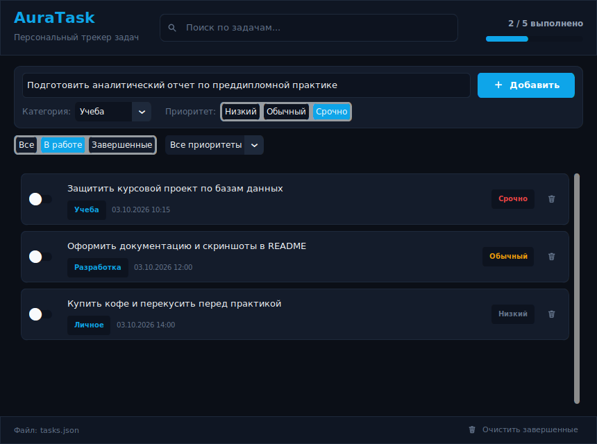
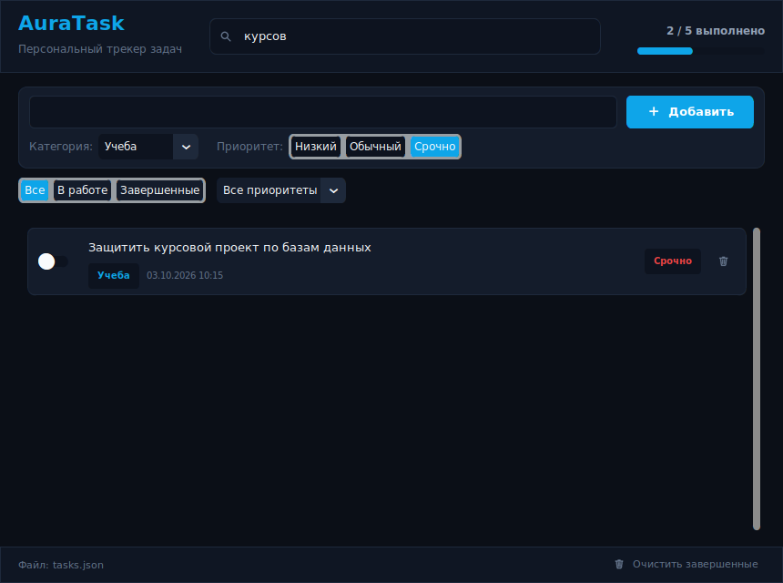

# AuraTask

Десктопный трекер задач с графическим интерфейсом на Python и CustomTkinter. Оформлен в темной теме с эффектом матового стекла (Glassmorphism / Fluent Acrylic), использует систему переключателей для смены статуса задач и векторные иконки без сторонних шрифтов и эмодзи.

## Особенности реализации

- Темная тема с акриловыми полупрозрачными карточками и тонкими рамками.
- На Windows 10/11 автоматически подключаются темный режим DWM и системный акрил.
- Интерактивные переключатели (toggle switches) для быстрого завершения задач.
- Фильтрация по статусу (Все, В работе, Завершенные) и приоритету (Срочно, Обычный, Низкий).
- Поиск по тексту задачи и категориям в реальном времени.
- Векторная отрисовка иконок через Pillow (без использования Unicode-эмодзи).
- Атомарное сохранение в JSON с защитой от повреждения при сбоях и автоматическим созданием бэкапа.
- Настроенный GitHub Actions CI/CD для автосборки под Windows x64 и Win32 (x86).

## Интерфейс

| Активный список задач и фильтр | Быстрый поиск по задачам |
| :---: | :---: |
|  |  |


## Структура проекта

```text
AuraTask/
├── .github/workflows/
│   └── build-release.yml   # Автосборка Win32/x64 и публикация релиза v0.0.1
├── src/
│   ├── app.py              # Основное окно приложения и логика интерфейса
│   ├── glass_theme.py      # Палитра цветов, стили и интеграция с Windows DWM
│   ├── icons.py            # Генератор векторных иконок через Pillow
│   ├── models.py           # Модель данных задачи Task
│   └── storage.py          # Модуль сохранения и загрузки tasks.json
├── tests/
│   └── test_core.py        # Модульные тесты хранилища, моделей и отрисовки
├── main.py                 # Точка входа в программу
├── requirements.txt        # Список зависимостей
└── README.md
```

## Требования

- Python 3.10 или новее
- Windows 10 / 11 (рекомендуется для эффекта акрила) или Linux / macOS

## Установка и запуск

1. Склонировать репозиторий:
```bash
git clone https://github.com/camo666C/AuraTask.git
cd AuraTask
```

2. Создать и активировать виртуальное окружение:
```bash
python -m venv venv
# Windows:
venv\Scripts\activate
# Linux/macOS:
source venv/bin/activate
```

3. Установить зависимости:
```bash
pip install -r requirements.txt
```

4. Запустить приложение:
```bash
python main.py
```

При необходимости можно передать путь к пользовательскому файлу задач:
```bash
python main.py my_tasks.json
```

## Запуск тестов

Тесты покрывают сериализацию моделей, работу атомарного хранилища, восстановление поврежденного JSON и генерацию иконок:

```bash
python -m unittest discover -s tests
```

## Локальная сборка в .exe

Для ручной сборки одного исполняемого файла под Windows используется PyInstaller:

```bash
pyinstaller --noconfirm --onefile --windowed --name "AuraTask" --collect-all customtkinter main.py
```

Собранный файл появится в каталоге `dist/`.

## Автоматическая сборка (CI/CD)

В репозитории настроен воркфлоу GitHub Actions:
- Срабатывает при каждом push в ветку `main` или `master`.
- Собирает два исполняемых файла на виртуальной машине Windows:
  - `AuraTask-x64.exe` (для 64-битных систем)
  - `AuraTask-win32.exe` (для 32-битных систем на базе Python x86)
- Автоматически обновляет релиз с тегом `v0.0.1`, удаляя старый релиз и прикрепляя свежие бинарники.
